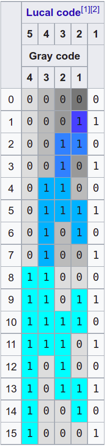

# `gray.c`

给定一个十进制非负整数，取值范围在 [0, 15]，
请求出这个数的 [Gray Code @ wiki](https://en.wikipedia.org/wiki/Gray_code) 。

举例:
- 输入 `10` ，输出 `1111`
- 输入 `2` ，输出 `0011`

求 Gray Code 的步骤如下:
- 将十进制数转换为**四位**的二进制数 (e.g. `10 -> 1010`)
  - 注意: 结果需要是四位。比如, `3` 需要转换为 `0011`, 具体转换方法请自行查阅资料
- 用每位和它左边一位的异或值替代原来的值 (e.g. `1010 -> 1111`)
  - 比如: 左起第二位新值 (1) = 左起第一位旧值 (0) `^` 左起第二位旧值 (1)
  - `1 = 0 ^ 1`: 这里的 `^` 表示 [`按位异或运算` (XOR)](https://en.wikipedia.org/wiki/Bitwise_operations_in_C#Bitwise_XOR_^)