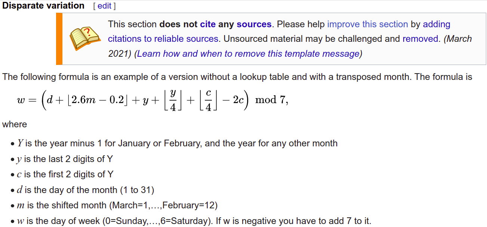

# `weekday.c`

利用 [Gauss's Algorithm @ wiki](https://en.wikipedia.org/wiki/Determination_of_the_day_of_the_week#Disparate_variation),
根据给定的日期, 计算当日是周几。

- 输入: 三个整数, 分别表示年月日, 之间以空格相隔
- 输出: 周几 (`0` 代表周日，`1` 代表周一，以此类推)

示例:

- 输入: 2021 10 12
- 输出: 2

提示:
- 你可能需要使用 `floor` 函数, 请自行查找其含义与用法。
- 如果你得到了一个 `double` 类型的数 `d` (它其实是一个整数，比如 `100.0`)，
想要对它进行对 7 取模操作，可以这么操作:
    - `(int) d % 7`
    - 解释: 由于 `%` 要求两个操作数都是整型数, 而 `d` 是 `double` 类型的值，
    所以需要先用 `(int)` d 将 `d` 转化成 `int` 类型。